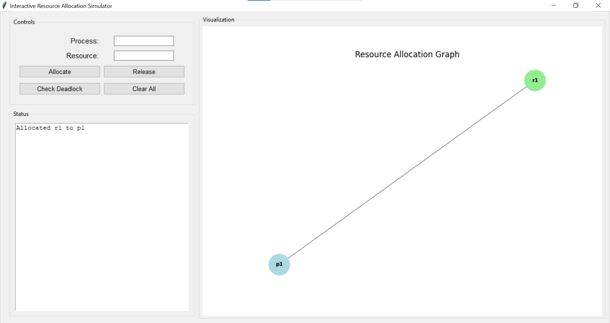
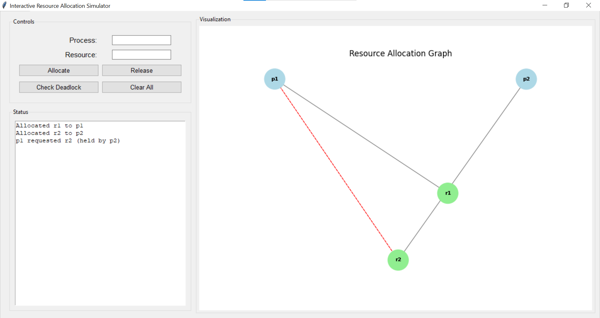
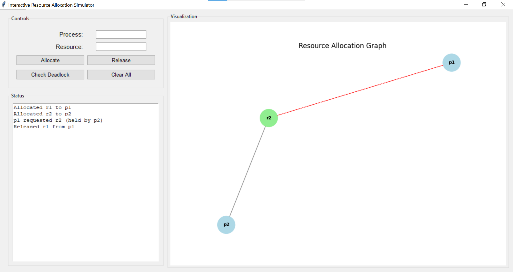

# Deadlock Simulator (Interactive Resource Allocation Graph Visualizer & Analyzer)

An **interactive desktop application** to simulate and visualize resource allocation in operating systems. Users can create processes and resources, allocate/release resources, visualize the Resource Allocation Graph (RAG), detect deadlocks, and analyze system states.

---

## Features

- **Interactive Resource Management**
  - Allocate resources to processes.
  - Release resources and automatically assign to waiting processes.
  - Log all actions in a status window.

- **Deadlock Detection**
  - Detects deadlocks using cycle detection in the resource allocation graph.
  - Highlights deadlocked processes and resources in red.
  - Provides clear textual messages for detected deadlocks.

- **Graph Visualization**
  - Processes (light blue), Resources (light green)
  - Deadlocked nodes highlighted in red
  - Allocation edges: gray, Request edges: red dashed
  - Dynamic updates based on user actions.

- **Clear All**
  - Resets all processes, resources, and requests.

---

## Learning Objectives Covered

1. **Model OS Resource Allocation Concepts:**  
   - Uses `networkx` directed graphs to represent processes, resources, allocation, and request edges.

2. **Implement Deadlock Detection & Safety Check Algorithms:**  
   - Detects cycles in the resource allocation graph to identify deadlocks.
   - Reports cycles clearly in textual logs and highlights affected nodes visually.

3. **Build Interactive UI:**  
   - Tkinter-based GUI translates user inputs (allocate/release) into graph transformations and triggers deadlock detection automatically.

4. **Analyze & Report Results:**  
   - Status window logs all operations.
   - Visualization clearly represents system state and deadlocks.

---

## File Structure

```
.
├── src
│   ├── gui.py               # Main GUI application
│   ├── allocation.py        # Backend resource allocation and deadlock detection
│   └── visualization.py     # Graph visualization module
├── output
│   ├── scenario1.png        # Example output screenshots
│   ├── scenario2.png
│   └── scenario3.png      
└── README.md
```

---

## Installation

1. Clone the repository:
```bash
git clone https://github.com/zuni-developer/Deadlock-Simulator
cd Interactive-resource-allocation-graph-simulator
```

2. Install dependencies:
```bash
pip install networkx matplotlib
```

---

## Usage

Run the main application:

```bash
python src/gui.py
```

### GUI Components

- **Process Entry:** Enter the process name.  
- **Resource Entry:** Enter the resource name.  
- **Buttons:**
  - **Allocate:** Allocate the resource to the process (or request if already allocated).  
  - **Release:** Release the resource from the process.  
  - **Check Deadlock:** Detect deadlocks and display warnings.  
  - **Clear All:** Reset the simulation.  
- **Status Window:** Logs messages for all actions.  
- **Visualization Canvas:** Dynamically shows the resource allocation graph.

---

## Example Scenarios

### Scenario 1: Simple Allocation

- Process `P1` allocated to resource `R1`.  
- Resource allocation edges shown in gray.

### Scenario 2: Deadlock Detection

- Circular wait detected: `P1 -> R1 -> P2 -> R2 -> P1`.  
- Deadlocked nodes highlighted in red.  
- Request edges shown as red dashed lines.

### Scenario 3: Resource Release

- Released `R1` from `P1`.  
- Waiting processes automatically allocated resources.  
- Graph updated dynamically.

---

## Implementation Details

- **Graph Representation:**
  - Nodes: Processes and resources
  - Edges:
    - `Allocation` (Resource → Process)  
    - `Request` (Process → Resource)  

- **Deadlock Detection:**  
  - Uses `networkx.simple_cycles` to detect cycles with both allocation and request edges.  

- **Visualization:**  
  - `matplotlib` integrated with Tkinter canvas for dynamic updates.  

---

## Future Improvements

- Implement **safety algorithm** to check safe states.  
- Suggest **recovery actions** for deadlocks (terminate process, preempt resource).  
- Add **multiple resource types** and batch allocations.  
- Export/Import simulation states for reproducibility.

---

## 📌 About This Fork

This project is forked from the original repository:  
**Interactive Resource Allocation Graph Simulator**  
by Ch Shiva Kalyan, Abhiram, and Mohd Subhan.

### Modifications in This Fork
- Rewritten and expanded README documentation
- Improved project structure and file organization
- Enhanced feature descriptions and learning objectives
- Added example scenarios and future improvement roadmap
---
